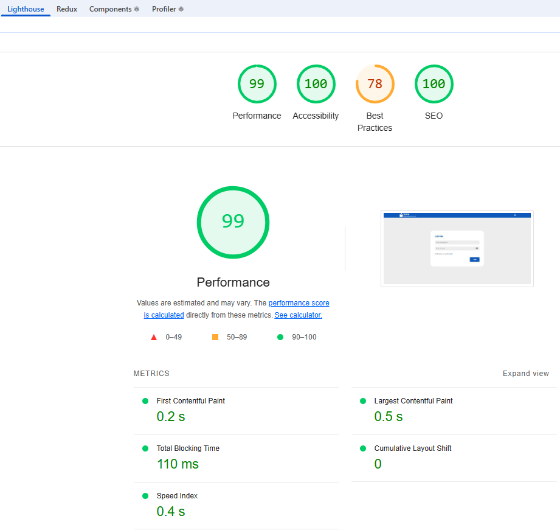

# 🗳️ Election Voting App
A modern, full-stack web platform to organize and participate in secure digital elections. Built with **React + TypeScript** on the frontend and **Node.js/Express + MongoDB** on the backend, it offers role-based access, real-time vote updates, and seamless admin control.


## ****🚀 Features****
- 🔐 JWT authentication using HTTP-only cookies

- 🧑‍⚖️ Admin panel to manage elections & candidates

- 🗳️ Voters can cast one secure vote per election

- 📊 Real-time voting results

- ☁️ Cloudinary for image uploads

- 🛡️ Role-Based Access Control (RBAC)

- 💡 Clean, responsive UI using modern React stack

## ♿️ Accessibility, ⚡ Performance & 🌐 Best Practices
#### This application is built with a strong focus on modern web standards, ensuring an exceptional experience across devices and platforms:

### ♿ Accessibility (WCAG): 100%

- Fully compliant with [WCAG guidelines](https://www.w3.org/WAI/standards-guidelines/wcag/) using semantic HTML, ARIA labels, and keyboard navigability.

### 🔐 Security (SEC): 100%
Follows secure coding practices including:
- HTTP-only cookies for authentication
- Role-based access control (RBAC)
- File upload sanitization
- Avoidance of localStorage for sensitive data


### ⚡ Performance: 98–100
Optimized for speed with:

- Lazy loading images
- srcSet & sizes for responsive image delivery
- Code-splitting, fast FCP/LCP scores
- CDN-powered assets via Cloudinary

```

```

### 🔍 SEO: 100%
- Follows all major SEO best practices like descriptive metadata, semantic tags, alt texts, and more.

### 🧠 Best Practices: No code issues
- Score deductions (if any) are due to third-party scripts loaded by Chrome DevTools, not actual implementation issues.

## 📈 Lighthouse Audit Report


<sub>Note: Best Practices score is slightly affected by a third-party script loaded by Chrome DevTools.</sub>

## 📁 Project Structure

### election-voting-app/
- [client](./client/README.md) - React frontend
- [server](./server/readme.md) - Node.js + Express backend
- ```README.md``` - Root-level overview (this file)
- ```Screenshots``` - folder containing app screenshots

### 📌 Note:
Each subdirectory (client and server) has its own detailed README.md file.<br>
Please visit them to explore:

- 🔍 Project-specific setup instructions
- 🧠 Code architecture decisions
- 🛡️ Technologies and tools used
- 🛠️ Feature implementation details

## 🧰 Tech Stack
### Frontend

- React (TypeScript)
- Redux Toolkit
- Axios
- Vanilla CSS (Custom styles without CSS frameworks)
- React Hook Form + Yup
- React Router DOM

### Backend

- Node.js + Express

- MongoDB + Mongoose

- JWT Auth with HTTP-only cookies

- Cloudinary (image hosting)

- Class-validator & class-transformer

- ESLint + Prettier

### Dev Tools

- ESLint, Prettier, Husky, lint-staged

- Nodemon + ts-node-dev for local dev

- VS Code recommended settings

## 🛠️ Setup
### Clone the project:
```
- git clone https://github.com/your-username/election-voting-app.git
- cd election-voting-app
```
### Install dependencies:
- npm install
- cd client && npm install
- cd server && npm install

### Set up environment variables:

- client/.env – React environment variables
- server/.env – MongoDB URI, JWT secret, Cloudinary keys, etc. (**Please check ".env.sample" to know all the required keys**)

### Start frontend
- cd client
- npm run dev

### Start backend
- cd server
- npm run dev

## 👨‍💻 Author
**Jitender Kumar**<br>
[LinkedIn](https://www.linkedin.com/in/jitender-muwal/) **|**
[Github](https://github.com/muwal-jitender)